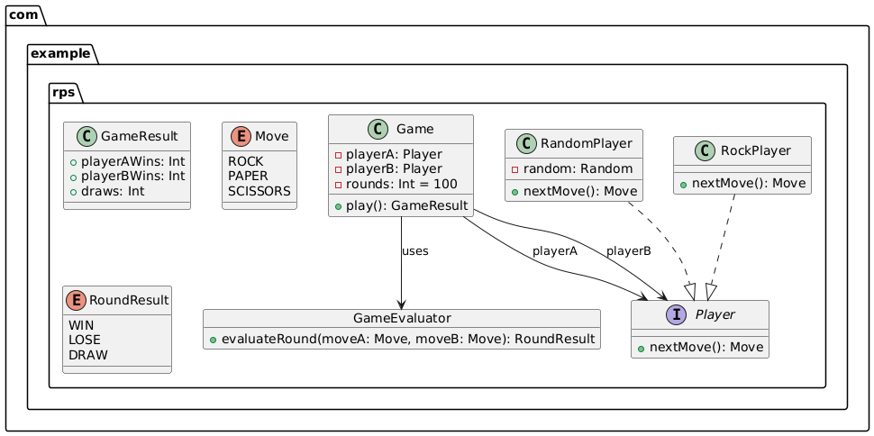

# Rock-Paper-Scissors Game

A simple Kotlin-based Rock-Paper-Scissors game simulation that demonstrates clean code principles, SOLID design, and TDD
best practices. In this version, the game simulates **100 rounds** where:

- **Player A** plays randomly.
- **Player B** always plays ROCK.

## Table of Contents

1. [Project Overview](#project-overview)
2. [Functional Requirements](#functional-requirements)
3. [Project Structure](#project-structure)
4. [Build & Run Instructions](#build--run-instructions)
5. [Testing & Coverage](#testing--coverage)
6. [CI/CD with GitHub Actions](#cicd-with-github-actions)
7. [Steps-Executed](#Steps-Executed)
8. [UML](#UML)

## Project Overview

The Rock-Paper-Scissors game is implemented in Kotlin and demonstrates the following key points:

- **Two distinct player strategies:**
    - *Player A*: Chooses a move at random.
    - *Player B*: Always chooses ROCK.
- **Fixed rounds:** The game runs for **100 rounds** by default.
- **Clear outcome evaluation:** Each round is assessed using standard game rules.

## Functional Requirements

1. **Player Strategies:**
    - Player A selects one of the three moves (ROCK, PAPER, or SCISSORS) at random.
    - Player B consistently selects ROCK.
2. **Round Evaluation:**
    - **ROCK vs. SCISSORS:** ROCK wins.
    - **PAPER vs. ROCK:** PAPER wins.
    - **SCISSORS vs. PAPER:** SCISSORS wins.
    - Identical moves result in a draw.
3. **Result Aggregation:**
    - After **100 rounds**, the game outputs the number of wins for Player A, Player B, and the number of draws.

## Project Structure

```plaintext
rps/
├── .github/
│   └── workflows/
│       └── maven.yaml
├── src/
│   ├── main/
│   │   └── kotlin/
│   │       └── com.example.rps/
│   │           ├── Game.kt
│   │           ├── GameEvaluator.kt
│   │           ├── Main.kt
│   │           ├── Move.kt
│   │           ├── Player.kt
│   │           ├── RandomPlayer.kt
│   │           ├── RockPlayer.kt
│   │           └── RoundResult.kt
│   └── test/
│       └── kotlin/
│           └── com.example.rps/
│               ├── GameEvaluatorTest.kt
│               ├── GameTest.kt
│               ├── MainTest.kt
│               ├── RandomPlayerTest.kt
│               └── RockPlayerTest.kt
├── pom.xml
└── README.md
```

# Build & Run Instructions

## Prerequisites

- **Java:** JDK 11 or higher.
- **Maven:** Version 3.x.

## Build the Project

```bash
mvn clean compile
```

## Run the Game

```bash
mvn exec:java -Dexec.mainClass="com.example.rps.Main"
```

## Generate JaCoCo Coverage Report

```bash
mvn clean verify
```

The coverage report will be located in the target/site/jacoco/ directory.

# Testing & Coverage

Testing Framework: JUnit 5 is used for unit tests.

## Executing Tests

```bash
mvn test
```

## Test Coverage

9 tests covering game logic, player strategies, and output formatting.
Coverage reports are generated by the JaCoCo plugin and can be found in target/site/jacoco/.

# CI/CD with GitHub Actions

The project integrates with GitHub Actions using the workflow defined in .github/workflows/maven.yaml:

# Steps-Executed
Checkout Code: Retrieves the latest code.
Set Up JDK 11: Configures the Java environment.
Build & Test: Compiles the project and runs all tests.
JaCoCo Coverage: Generates and uploads the code coverage report.

# UML


